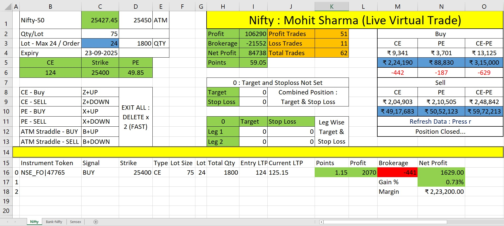

📊 Virtual Options Trading Dashboard (Python + Excel)

This project is a live virtual trading simulator for Nifty, BankNifty, and Sensex options.
It streams real-time option prices, lets you place buy/sell trades instantly, tracks P&L (including brokerage and charges), and logs your entire trading journey — all without risking real money.

It’s like a flight simulator for traders: you experience the thrill of trading in real market conditions, while learning discipline, margin management, and the impact of costs.

🗂 Dashboard Overview

🔹 Market Data Inputs (Excel Sheet)
Cell C2 (Spot Price LTP): Updates tick by tick with the live spot price of the index.
Cell C3 (Lot Size): Shows the lot size of the selected index (e.g., Nifty = 75).
Cell C3 (Max Lot / Order): Default = 24.
If the entered lot exceeds this, orders are auto-sliced.
Example: Entering 48 lots → 2 separate orders of 24 lots each (1800 qty each).
Cell C4 (Expiry): Current expiry contract (always the most liquid).
Cell C6 (Strike Price): User can enter strike here (default ATM ± 5 strikes available).
Cells B6 & D6 (CE/PE LTP): Continuously updated based on the strike entered.
Cell D1 (ATM): Displays the current At-The-Money strike based on spot.
Cell D3 (Qty): Final trading quantity (Lot Size × Lots entered).
👉 Note: Excel is used only for inputting strike, lot size, and target/stop loss.

🔹 Trade Summary (Day-Wise Log) : Table H2:K5
Profit / Brokerage / Net Profit / Points Captured
Number of Winning Trades / Losing Trades / Total Trades
✔️ Resets daily
✔️ A detailed trade log is auto-saved in : Credentials/Trade_log

🔹 Target & Stop Loss Settings : Table H7:K9
Pre-set Target and Stop Loss (entered in points, not ₹).
Entering 0 = no target or stop loss.
Both must be positive numbers.
Table H11:K13 (Straddle Mode)
Special case for ATM Straddle (CE+PE same strike) trades.

If enabled (H11=1):
If one leg hits Target/SL → only that leg is closed.
Other leg continues until it also hits Target/SL.
Can also enable combined Target/SL (cells I8 & I9).
Default = H11=0 (inactive unless straddle is traded).

🔹 Brokerage & Margin Calculator : Table M2:O12
Brokerage shown = Entry + Exit (round trip).
Updates automatically based on lots entered in C3 (press r to refresh).
Displays required margin for:
Single-leg Buy/Sell trades
Straddle Buy/Sell trades
✔️ Helps you estimate costs before placing any order.

🔹 Live Trade Panel (Below the yellow line)
Displays live trade details tick by tick once you place an order:
Instrument Token
Signal (Buy/Sell)
Strike Price & Option Type (CE/PE)
Lot Size / Quantity
Entry Price vs Current LTP
Points Captured
Gross Profit
Brokerage Deducted
Net Profit (₹)
Gain %
Margin Used

👉 Makes the simulator realistic, since it deducts brokerage and costs per trade — unlike broker terminals that only show net P&L per instrument.

🎯 Key Features
✅ Live tick-by-tick LTP updates
✅ Buy/Sell orders for CE/PE options (ATM ± 5 strikes)
✅ Straddle trading with leg-wise or combined Target/SL
✅ Day-wise trade summary + auto trade log file
✅ Brokerage + margin calculator (entry + exit, all costs included)
✅ Per-trade P&L tracking (unique USP)
✅ Real-time Profit, Net Profit, and Gain % updates

🚀 How to Use
Open Excel file → Input:
Strike (C6)
Lot size (C3)
Target/Stop Loss (H7–K9)
Keep the CMD window active at all times.
All commands (Buy, Sell, Exit, Refresh r) must be given in the CMD window.
Excel is only for input fields (strike, lot, target/SL).
Place trades using keyboard hotkeys (see below).
Track live P&L in the trade panel.
End of day → Review daily trade log in:
Credentials/Trade_log.

⚡ Hotkeys Reference (CMD Window)
CE Buy → Z + UP
CE Sell → Z + DOWN
PE Buy → X + UP
PE Sell → X + DOWN
ATM Straddle Buy → B + UP
ATM Straddle Sell → B + DOWN
Exit All → DELETE × 2 (fast)
Refresh Brokerage/Margin → r
👉 Important: CMD must be active when pressing these keys.

📌 Why This Dashboard?
Unlike broker platforms that only show net P&L per instrument, this simulator breaks down P&L per trade (after brokerage + taxes).
This helps you:
See the true cost of over-trading
Understand how brokerage eats into profits
Train yourself in risk management & discipline

✨ In short
This dashboard is the safest way to practice live trading — real-time, rule-based, cost-aware, and discipline-driven.
