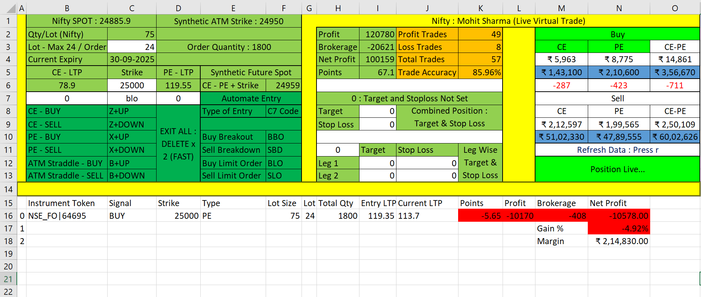

# 📊 Virtual Options Trading Dashboard (Python + Excel)

This project is a **live virtual trading simulator** for Nifty, BankNifty, and Sensex options.  
It streams real-time option prices, lets you place buy/sell trades instantly, executes automatic breakout/breakdown strategies, applies target and stop-loss orders, and maintains a complete trade history — all without risking real money.

It’s like a **flight simulator for traders**: you experience real market conditions, practice automation logic, and learn discipline, margin control, and cost-awareness.

---

## 🗂 Dashboard Overview

### 🔹 Market Data Inputs (Excel Sheet)
- **Spot Price LTP:** Live index spot price tick by tick.
- **Synthetic ATM Strike:** Live index spot price tick by tick.
- **Cell C2 (Lot Size):** Lot size of the selected index (e.g., Nifty = 75).
- **Cell C3 (Max Lot/Order):** Default = 24. Larger orders are auto-split.  
  Example → Entering 48 lots = 2 × orders of 24 lots (1800 qty each).
- **Cell C4 (Expiry):** Current expiry contract (always most liquid).
- **Cell C6 (Strike Price):** Custom strike entry (ATM ± 5 strikes visible).
- **Cells B6 & D6 (CE/PE LTP):** Auto-updating LTPs for strikes.
- **Cell D1 (ATM):** Current At-The-Money strike.
- **Cell D3 (Qty):** Final trading quantity (Lot Size × Lots entered).  
👉 **Excel is used only for input (strike, lot, target/SL).**

---

## 🔀 Automated Entry Logic

To make trading fully automated, you can configure the type of order in **Cell C7** and specify the trigger price in **Cell B7 or D7** (depending on CE/PE).

### 🔹 Breakout Buy Order (BBO)
- Entered price **must be ABOVE current LTP**.  
- When LTP rises to or beyond this price → **Buy order is triggered immediately**.  
- Target and Stop Loss can be pre-set → making entry and exit automatic.

### 🔹 Sell Breakdown Order (SBD)
- Entered price **must be BELOW current LTP**.  
- When LTP falls to or below this price → **Sell order is triggered automatically**.  
- Target/Stop Loss can also be auto-applied (optional).

### 🔹 Buy Limit Order (BLO)
- Entered price **must be BELOW current LTP**.  
- When LTP touches or falls below this price → **Buy order is placed**.  
- Used when you want to buy on dips.

### 🔹 Sell Limit Order (SLO)
- Entered price **must be ABOVE current LTP**.  
- When LTP touches or moves above this price → **Sell order is placed**.  
- Used when you want to sell at higher levels.

---

## 🔹 Trade Summary (Day-Wise Log)
(Table: H2:K5)
- Profit / Brokerage / Net Profit / Points Captured  
- Winning Trades / Losing Trades / Total Trades  
✔️ **Resets daily** and auto-saves to: `Credentials/Trade_log`

---

## ⚡ Hotkeys Reference (CMD Window) - Placing and Exiting Manual Order (Scalping)
- CE Buy → `Z + UP`  
- CE Sell → `Z + DOWN`  
- PE Buy → `X + UP`  
- PE Sell → `X + DOWN`  
- ATM Straddle Buy → `B + UP`  
- ATM Straddle Sell → `B + DOWN`  
- Exit All → `DELETE × 2`  
- Refresh Brokerage/Margin → `r`  

👉 **CMD must be active** when pressing keys.

---

## 🔹 Target & Stop Loss Settings
(Table: H7:K9)
- Enter target & stop loss in **points**, not ₹.  
- Entering `0` = no target or SL.  
- Both values must be **positive**.  

Special Case: **Straddle Mode** (Table H11:K13)  
- If enabled (`H11=1`):
  - One leg hitting Target/SL closes only that leg.
  - Other leg stays active until it hits its Target/SL.
  - Option to set **combined target/SL** (cells I8 & I9).
- Default = `H11=0` (inactive).

---

## 🔹 Brokerage & Margin Calculator
(Table: M2:O12)
- Brokerage = Entry + Exit (round trip).  
- Updates automatically based on lots in C3 (`press r` to refresh).  
- Shows required margin for:
  - Single-leg Buy/Sell trades  
  - Straddle Buy/Sell trades  
✔️ Helps estimate costs before placing an order.

---

## 🔹 Live Trade Panel
(Displayed below the yellow line)
- Instrument Token  
- Signal (Buy/Sell)  
- Strike Price & Option Type (CE/PE)  
- Lot Size / Quantity  
- Entry Price vs Current LTP  
- Points Captured  
- Gross Profit / Net Profit (₹)  
- Brokerage deducted  
- Gain %  
- Margin Used  

👉 Makes the simulator realistic with **per-trade P&L tracking (true cost)**.

---

## 🎯 Key Features
✅ Live tick-by-tick LTP updates  
✅ Buy/Sell orders for CE/PE options (ATM ± 5 strikes)  
✅ Automated entries: BBO, SBD, BLO, SLO  
✅ Straddle trading with leg-wise or combined Target/SL  
✅ Day-wise trade summary + auto trade log file  
✅ Brokerage + margin calculator (entry + exit, costs included)  
✅ Per-trade P&L tracking (unique USP)  
✅ Real-time Profit, Net Profit, and Gain % updates  

---

## 🚀 How to Use
1. **Open Excel file** → Input:
   - Strike (C6)  
   - Lot size (C3)  
   - Target/Stop Loss (H7–K9)  
   - Entry price & order type (B7/D7 + C7)  
2. Keep CMD window active. All commands must be given there.  
3. Place trades via hotkeys.  
4. Track live P&L in the dashboard.  
5. End of day → Review daily log in `Credentials/Trade_log`.

---

## 📌 Why This Dashboard?
Unlike broker platforms that only show per-instrument P&L, this simulator provides **per-trade insights after brokerage and taxes**.  
It helps you:  
- Understand the real cost of over-trading  
- See how brokerage affects profits  
- Train in discipline, risk, and trade management  

---

## ✨ In Short
This dashboard is the **safest way to practice live trading** — real-time, rule-based, cost-aware, and discipline-driven.

